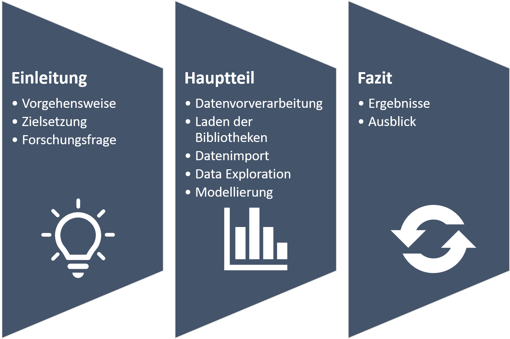

```{r setup, include=FALSE}
knitr::opts_chunk$set(echo = TRUE)
```
\newpage
# Einleitung
## Vorgehensweise und Zielsetzung
Die Zielsetzung dieses Projekts ist die Durchführung einer "Social Network Analysis" im Rahmen der Leistungsbeurteilung des gleichnamigen DHBW-Kurses. Die Datenbasis der Analyse und des Assignments stellt der Datensatz "Airline travel reachability network" dar (https://snap.stanford.edu/data/reachability.html).

Folgende Abbildung zeigt die Vorgehensweise dieses Projekts. In der Einleitung wird das Vorgehen des "Social Network Analysis Projekts" beschrieben. Weiterhin wird die Zielsetzung und die des Assignment zugrundeliegende Forschungsfrage definiert. Der Hauptteil des Assignments bildet eine "klassische" Vorgehensweise im Data Analytics Bereich ab. In einem ersten Schritt wird zunächst der theoretische Hintergrund des Projekts dargelegt. Dazu werden unter anderem Punkte wie die verfügbaren Daten, die Netzwerkdefinition, Flow Struktur und das Zentralitätsmaß näher beleichtet. Nach der Datenvorverarbeitung und dem Laden der notwendigen Bibliotheken, die für die Analyse notwendig sind, erfolgt der Datenimport. Weiterhin dient eine Explorative Analyse der Daten näheren Einblicken in die verfügbaren Daten und deren Qualität. Schließlich wird im letzten Schritt des Hauptteils die Modellierung und Visualisierung durchgeführt. Das Fazit beschäftigt sich zum Einen mit der Bündelung und Präsentation der Daten und zum Anderen einem Ausblick. \

<center>
{width=90%}
</center>


## Forschungsfrage
Der Datensatz "Airline travel reachability network" bildet Flugverbindungen für Flughäfen in den Vereinigten Staaten sowie Kanada ab. Zusätzlich sind dem Datensatz Informationen zu den Einwohnern der jeweiligen Stadt sowie geometrischen Daten in Form von Längen- und Breitengraden. Mit diesen Informationen bietet sich folgende Forschungsfrage an:

Werden Flughäfen in Städten mit mehr Einwohnern häufiger angeflogen, als Städte mit weniger Population? 

\newpage
# Hauptteil
## Theoretischer Hintergrund
Das Kapitel theoretischer Hintergrund dient dem Verständnis der nachfolgenden Netzwerkanalyse. Es wird unter anderem auf den Datensatz an sich eingegangen, der Netzwerktyp analysiert und Flow Struktur und Zentralitätsmaße erörtert.

### Datensatz
Bei dem Datensatz "Airline travel reachability network" handelt es sich um ein Netzwerk für die Erreichbarkeit von Städten in den Vereinigten Staaten und Kanada. Die Knoten im Datensatz bilden die einzelnen Flughäfen der Städte. Die Kanten repräsentieren die Flugverbindung. Diese sind so gewichtet, dass es eine Kante von Stadt i zu Stadt j gibt, wenn die geschätzte Flugreisezeit unter einem Schwellenwert liegt. Die Reisezeit schließt geschätzte Verspätungen bei Zwischenlandungen mit ein. 
Zusätzlich beinhalet der Datensatz, wie bereits erwähnt, Informationen zu den Einwohnern der jeweiligen Stadt sowie geometrischen Daten in Form von Längen- und Breitengraden.

### Netzwerkdefinition
Die Definition des Netzwerktyps beschreibt zum Einen WIE die Daten erhoben worden sind und zum Anderen aber auch WELCHE und WIEVIELE Datenpunkte zur Verfügung stehen.
Bei dem zugrundeliegenden Datensatz ist der Ursprung der Erhebung nicht publiziert. Daher lässt sich die Frage ob es sich bei der Erhebung um "Custom-made" Daten oder "Ready-made" Daten handelt nur in der Theorie beantworten. Sollte es sich um Custom-made Daten handeln wurden diese für einen spezifischen Zweck hin gesammelt. Dies kann durch Umfragen, Schneeball Analysen oder mithilfe einer Gesamterhebung stattfinden.

Bei Ready-made Daten ist der Datensatz als Nebenprodukt entstanden. Bei diesem Netzwerk ist es denkbar, dass mithilfe von Web-Crawlern bestimmter APIs die Daten abgezogen worden sind, beispielsweise von Buchungsseiten für Flugverbindungen oder "Arrival-Departure" Seiten. 

Weiterhin kann ein Netzwerk über einen Grundtyp definiert werden. Hierbei gibt es einerseits das Ego-Netzwerk, bei dem Beziehnungen eines Akeurs (Ego) zu anderen Akteuren (Alteri) der direkten Netzwerkumgebung, sowie den Beziehungen zwischen den Akteuren analysiert werden.
Als zweite Möglichkeit gibt es Schneeball-Netzwerke oder auch referentielles Netzwerk genannt. Hierbei wird mit einem Sample durch eine Erhebung gestartet und dann jeder Akteur zu den Attributdaten befragt. Die Erhebung endet wenn das Netzwerk gesättigt ist. 
Die Gesamterhebung analysiert alle Elemente eines Netzwerks inklusive deren Attribute und Beziehungen untereinander. 

Bei dem "Airline travel reachability network" handelt es sich wahrscheinlich um eine Gesamterhebung aller Flugverbindungen.
 
### Zentralitätsmaß
Um ein Netzwerk beziehungsweise einen Graphen analysieren zu können, ist die Wichtigkeit der Knoten und deren Kanten von hoher Bedeutung. Für die Analyse und die Beantwortung der Forschungsfrage ist die Anwendung von sogenannten Zentralitätsmaßen essentiell. 

Die Forschungsfrage "Werden Flughäfen in Städten mit mehr Einwohnern häufiger angeflogen, als Städte mit weniger Population?" wird in zwei Schritten beantwortet. Mithilfe des Zentralitätsmaßes "degree centrality" kann der Knoten mit der höchsten Zentralität im Netzwerk gefunden werden. Dies entspricht der Stadt beziehungsweise Flughafen mit den meisten Kanten, also den meisten Flugverbindungen. Anschließend kann geprüft werden, ob dieser Flughafen auch eine hohe Population hat. 

## Datenvorverarbeitung
### Laden der Bibliotheken
Als ersten Schritt der Datenvorverarbeitung werden die benötigten Bibliotheken für das Data-Wrangling, DIe Modellierung sowie die Visualisierungen geladen. 
```{r library, message=FALSE, warning=FALSE, paged.print=FALSE}
library("tidyverse")
library("igraph") 
library("tidygraph") 
library("ggraph")
library("ggplot2")
library("tinytex")
```


### Datenimport
Die Datenbasis für das Projekt besteht aus zwei CSV-Dateien, welche mithilfe eines Imports aus dem Ordner "Data" in das Environment geladen werden können.
Im Datensatz "Dat" befinden sich neben der node_id alle relevanten Zusatzinformationen wie die Geo-Daten, die Bevölkerung sowie die vollständigen Namen der Städte des Flughafens.
"Dat2" beinhaltet zum eine ID-Spalte sowie alle Flugverbindungen als Kantenliste.

```{r import, message=FALSE, warning=FALSE, paged.print=FALSE}
dat <- read_csv('Data/reachability-meta.csv')
dat2 <- read.table('Data/reachability.txt')
```

Nach erfolgreichem Datenimport und Betrachtung der Daten sind zwei Schritte nötig: Zum Einen müssen die Spalten des Datensatzes "dat2" umbenannt werden und zum Anderen negative Werte in positive umgewandelt werden.

```{r renaming columns}
dat2 <- dat2 %>% 
  rename(
    from = V1,
    weight = V2,
    to = V3
  )
```

```{r convert negative lines}
dat2$to <- dat2$to*(-1)
```


## Daten Exploration
Die Erkundung der zur Verfügung stehenden Datenbasis findet im Kapitel "Daten Exploration" statt. Als ersten Schritt wird jeweils mit dem Befehl "head()" der Kopf des Datensatzes ausgegeben und betrachtet. 

Weiterhin kann über "summary()" ein Blick auf die Datentypen und erste Statistiken des Datensatzes geworfen werden. Damit ist es möglich ein erstes Gefühl für die Datenbasis zu bekommen und eventuelle fehlende Daten oder falsche Datentypen in einem "Data-Cleaning" zu beheben.
In diesem Fall sind neben der Spaltenumbenennung und der Konvertierung der negativen Werte keine weiteren Manipulationen nötig. 

```{r exploring dat}
head(dat)
summary(dat)
```

```{r exploring dat2}
head(dat2)
summary(dat2)
```

\newpage
## Modellierung
Ziel des Kapitels Modellierung ist zum Einen ein Netzwerkobjekt als "tbl_graph" zu modellieren und zum Anderen weitere Attribute und Werte zu berechnen, die für die Visualisierungen und die Beantwortung der Forschungsfrage im "Fazit" notwendig sind.

Durch die Funktion "as_tbl_graph" kann die Kantenliste ganz einfach als tbl_object umgewandelt und als "net" gespeichert werden.

```{r produce tbl_object}
net <- as_tbl_graph(dat2)
```

Der nächste Schritt in der Netzwerkanalyse ist, wie im Kapitel "Zentralitätsmaße" erwähnt, die Berechnung des Grad der Zentralität. Dafür kann mithilfe der Funktion "degree" ganz einfach der Grad jedes Knoten berechnet werden. Um die berechneten Werte später verwenden zu können, wir das Array zusätzlich noch in einen Data Frame überführt. Außerdem werden die Zeilen mit den 10 höchsten Werten zur Betrachtung ausgegeben. 

```{r degree_df, message=FALSE, warning=FALSE}
degree <- degree(net)

degree_df <- as.data.frame(degree)

degree_df %>%
  top_n(10)
```

Zur Beantwortung der Forschungsfrage sind die Zusatzinformationen aus dem Datensatz "dat" unerlässlich. Aus diesem Grund werden die beiden Datensätze im nächsten Schritt "gejoined", sodass diese in einem Datensatz vorliegen. 

```{r joining, message=FALSE, warning=FALSE}

degree_df <- rowid_to_column(degree_df, "node_id")

degree_pop_df <- merge(x=degree_df, y=dat, by="node_id")

```

Interssant für die Interpretation der Daten sind die jeweils 10 höchsten Werte von Population und dem Grad der Zentralität. Aus diesem Grund werden diese Im nächsten Schritt berechnet und ausgegeben.

```{r calculating top, message=FALSE, warning=FALSE}
calc_top_degree <- top_n(x=degree_pop_df, n=10, wt=degree)
calc_top_degree
calc_top_pop <- top_n(x=degree_pop_df, n=10, wt=metro_pop)
calc_top_pop
```


## Visualisierung
Das Kapitel Visualisierung dient der erweiterten Daten Exploration. Mithilfe der nachfolgenden Plots können die Daten noch besser verstanden werden und weitere Erkenntnisse daraus geschlossen werden. 

Als ersten Plot wird die Verteilung des Grad der Zentralität für jeden Knoten ausgegeben. Dadurch kann ein Gesamtüberblick erreicht werden. Auffällig hierbei ist, dass es relativ viele Knoten gibt, bei denen der Grad 0 oder sehr klein ist. Interessant ist jedoch auch, dass es Knoten mit sehr großen Werten jenseits von 500 gibt. Diese könnten interessant für die Beantwortung der Forschungsfrage sein. 

```{r count degree}
ggplot(data = degree_df, aes(x = degree)) +
  geom_bar(size = .8, colour="#e2001a") +
  theme_classic() +
  scale_y_log10() +
  ggtitle("Verteilung Grad der Zentralität")

```

Weiterhin ist die Verteilung der Populationszahlen ein wichtiger Schritt im Verständnis des Datensatzes. Dafür kommt als nächste Visualisierung ein Boxplot zum Einsatz. Dieser zeigt den Durchschnitt der Bevölkerungszahlen sowie Ausreißer nach oben und unten. 

```{r pop viz}
ggplot(data = degree_pop_df, aes(y=metro_pop)) +
  geom_boxplot(size = .8) +
  theme_classic() +
  scale_y_log10() +
  ggtitle("Verteilung Bevölkerung")
```

Für die Visualisierung des Netzwerks wird aus Übersichtsgründen als ersten Schritt ein Sample von 200 Datenpunkten extrahiert. Anschließend folgen drei verschiedene Plots des Netzwerks.

```{r sample}
dat_sample <- sample_n(dat2, 200)

net_sample <- as_tbl_graph(dat_sample)

ggraph(net_sample, layout = 'fr', maxiter = 100) + 
  geom_node_point(colour="#e2001a") + 
  geom_edge_link(alpha = .4) +
  theme_graph()

ggraph(net_sample, layout = 'kk', maxiter = 100) + 
  geom_node_point(colour="#e2001a") + 
  geom_edge_link(alpha = .4) +
  theme_graph()


# coord diagramm
ggraph(net_sample, layout = 'linear', circular = TRUE) + 
  geom_node_point(colour="#e2001a") +
  geom_edge_arc(alpha = .4) +
  theme_graph()
```

\newpage
# Fazit
## Ergebnisse
Im Folgenden werden nun die Ergebnisse aus den vorangegangenen Kapiteln zusammengefasst und gebündelt. Weitherhin wird eine Antwort auf die Forschungsfrage, ob Flughäfen in Städten mit mehr Einwohnern häufiger angeflogen werden, als Städte mit weniger Population, gegeben. 

Das vorangegangene Kapitel zeigt die 10 Städte, bei denen der Grad der Zentralität am höchsten ist. Dies sind also die Flughäfen, die am meisten Kanten also Flugverbindungen haben. Da es sich um gerichtete Kanten handelt, entspricht der Grad den ein- und ausgehenden Kanten. Mit diesen "zentralen" Flughäfen des Datensatzes kann nun also eine Interpretation bezüglich der Bevölkerung in diesen Städten vorgenommen werden. \
Dafür werden im Folgenden das globale Maximum und Minimum aller Populationszahlen ermittelt: \

```{r calculating population}
max_population <- max(degree_pop_df$metro_pop)
min_population <- min(degree_pop_df$metro_pop)
mean_population <- mean(degree_pop_df$metro_pop)

mean_population_df <- data.frame(mean_population)


calc_top_degree$mean_population <- mean_population
```

Das Maximum der Populationszahlen liegt bei: 
```{r max pop}
max_population
```

Und das Minimum liegt bei:
```{r min pop}
min_population
```

Um zu beurteilen, ob eine Stadt besonders viel oder wenig Bevölkerung hat, wird hier als Metrik das Arithmetische Mittel verwendet. Dieses liegt bei:
```{r mean pop}
mean_population
```

Um nun die Verbindung aus den Zentralitätsdaten und den Bevölkerungszahlen herzustellen, wird dafür nachfolgend eine Visualisierung verwendet. \
Diese zeigt die Top 10 Städte mit dem höchsten Grad der Zentralität im Datensatz sowie die 

```{r results}
ggplot(calc_top_degree, aes(x=name, y=metro_pop))+
  geom_col(size=5, alpha=.7) +
  scale_y_continuous(labels = scales::comma) +
  geom_hline(yintercept=mean_population, colour = "#e2001a", linetype="dashed") +
  geom_text(aes(0,round(mean_population, digits = 0), label = round(mean_population, digits = 0), vjust = -1, hjust = -.5), colour = "#e2001a") +
  theme_minimal() +
  theme(axis.text.x = element_text(angle = 45, vjust = 0.5, hjust=1)) +
  xlab("") +
  ylab("Population") +
  ggtitle("Top 10 - Grad der Zentralität und Bevölkerung")
```

## Reflexion
